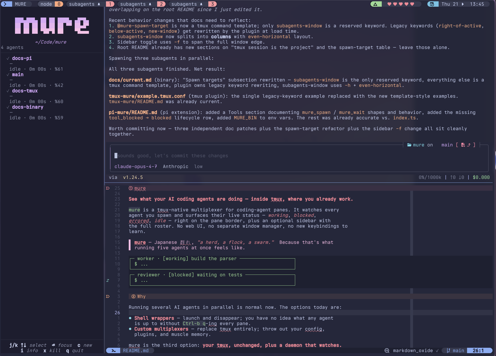

# mure

> **mure** _mɯ̟́ɾè̞_ — Japanese 群れ, *"a herd, a flock, a swarm."* 

*See what your AI coding agents are doing — inside tmux, where you already work.*

`mure` is a tmux-native multiplexer for coding-agent panes. It watches every
agent you spawn and surfaces their live status — *working*, *blocked*,
*idle* — visible via `mure ls` and an optional sidebar with the full roster.

No web UI, no separate window manager, no new keybindings to learn.




## Why

Running several AI agents in parallel is normal now. The options today are:

- **Shell wrappers** — launch and disappear; you have no idea what any agent
  is up to without `Ctrl-b q`-ing every pane.
- **Custom multiplexers** — replace tmux entirely; throw out your config,
  plugins, and muscle memory.

mure is the third option: **your tmux, unchanged, plus a daemon that watches.**

## No projects. Just tmux sessions.

Most agent managers (Claude Squad, Conductor, sketch.dev, etc.) ship their
own notion of a *project*: a named container that owns a working directory,
an agent roster, layout, and lifecycle. You create projects in their UI,
switch between them in their UI, and your editor/terminal/tmux setup lives
separately — or gets swallowed entirely.

mure doesn't have projects. **A tmux session *is* the project.**

- The daemon is scoped per tmux session — one socket at
  `…/mure/<session>/daemon.sock`, one roster, one sidebar.
- The working directory is whatever the pane's shell is in. No metadata file,
  no "project root" registry.
- Switching projects = `tmux switch-client`. Listing them = `tmux ls`.
  Persistence = whatever you already use (tmux-resurrect, tmuxinator, a
  shell function, nothing at all).
- Tearing down a project = `tmux kill-session`. The daemon goes with it.

If you already organise work as one-tmux-session-per-repo, mure slots in
without asking you to learn a second hierarchy.

## Where new agent panes land

When something (you, or another agent via `mure_spawn`) spawns an agent,
mure has to pick *where* the new pane appears. That's controlled by
`@mure-spawn-target`, set in your `.tmux.conf`. The value is either the
reserved keyword `subagents-window` *(default)* — which triggers
find-or-create of a dedicated window — or **any tmux command** that
creates a pane. mure appends `-P -F '#{pane_id}' <agent-command>` and
runs it.

The default keeps agents out of the window you're working in: mure finds
a window tagged `@mure-subagents-window=1` in the current session and
splits it, otherwise creates one named `subagents` in the background.
Leave `@mure-spawn-target` unset (or set it to `subagents-window`) to
get this behaviour.

For anything else, set it to a tmux pane-creating command:

```tmux
set -g @mure-spawn-target "split-window -h"               # new column next to active pane
set -g @mure-spawn-target "split-window -v"               # new row below active pane
set -g @mure-spawn-target "new-window"                    # one agent per window, foregrounded
set -g @mure-spawn-target "split-window -h -f"            # full-height right column
set -g @mure-spawn-target "split-window -v -f -l 30%"     # bottom strip, 30% tall
set -g @mure-spawn-target "new-window -t :9"              # pin to window index 9
```

## Install

Requires **tmux ≥ 3.2** and (from source) **Go ≥ 1.24**.

```sh
# from source
git clone https://github.com/<owner>/mure
cd mure
make build          # → ./bin/mure, then move it onto your $PATH
```

Add a sidebar toggle to your `~/.tmux.conf` (optional, recommended):

```tmux
bind-key M run-shell "mure sidebar --toggle"
```

Reload tmux (`tmux source-file ~/.tmux.conf`).

Teach a coding-agent harness to report into mure:

```sh
mure integration list                  # show available harnesses
mure integration install pi             # or: claude, opencode
```

Check everything's wired:

```sh
mure doctor
```

## Adding a harness

See [`harnesses/README.md`](./harnesses/README.md) for the full guide and manifest schema reference.


## Use it

```sh
mure up                       # start the daemon for this tmux session
mure spawn worker "build X"   # open a pane running an agent
mure ls                       # list agents (add --json for scripts)
mure sidebar                  # open the live roster (or prefix-M)
mure focus <agent>            # jump to that agent's pane
mure wait <agent>             # block until the agent emits its final result
mure down                     # stop the daemon
```

See agent state via:

- **`mure ls`** (or `mure ls --json`) — current roster.
- **The sidebar** — `mure sidebar --toggle` (bind to `prefix + M` per Install).

### Agents that orchestrate other agents

Harnesses with `subtools = true` in their manifest (currently `claude`,
`opencode`, and `pi`) ship a skill file that teaches the agent about two
shell commands:

- `mure spawn <role> [task]` — fan out a sibling agent in a new pane.
- `mure wait <agent_id>` — block until that agent emits its final result.

Useful for "planner spawns five workers, waits for all of them" workflows.
The skill is only installed inside mure-managed panes, so the tools are
invisible to agents you run outside of mure.

## Customize

A few tmux options you might care about, set in your `~/.tmux.conf`:

```tmux
set -g @mure-sidebar-width    36
set -g @mure-sidebar-position left           # left | right | top | bottom
set -g @mure-spawn-target     subagents-window
#                             ^ keyword `subagents-window` or any tmux
#                               pane-creating command (see above)
```

## What's in the box

| Piece | What it does |
|---|---|
| `mure` daemon + CLI | One small Go binary. The only thing you install. |
| Sidebar TUI | Bubble Tea pane (`mure sidebar`), toggled via `mure sidebar --toggle`. |
| Harness manifests | `harnesses/<name>/` ships a manifest + skill + installable files (hooks, plugins) for each supported coding agent (`pi`, `claude`, `opencode`). |

The daemon talks NDJSON over a per-session Unix socket
(`~/Library/Caches/mure/<session>/daemon.sock` on macOS,
`$XDG_RUNTIME_DIR/mure/<session>/` on Linux, mode `0700`). Nothing leaves
your machine.

## Development

```sh
make build         # build ./bin/mure
make test          # go test ./... + shellcheck
make tmux-test     # real-tmux hook integration test
make acceptance    # run test/acceptance.sh end-to-end
make verify        # everything, including lint
```

Design notes and spec history live under [`specs/`](./specs/); the current
shape of the codebase is in [`specs/current.md`](./specs/current.md).

## License

TBD.
